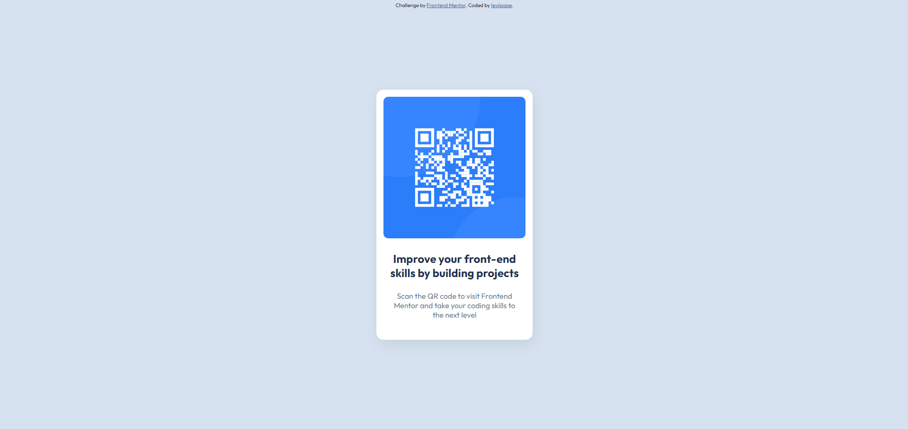

# Frontend Mentor - QR code component solution

This is a solution to the [QR code component challenge on Frontend Mentor](https://www.frontendmentor.io/challenges/qr-code-component-iux_sIO_H).

## Table of contents

- [Screenshot](#screenshot)
- [Links](#links)
- [Author](#author)

### Screenshot

### Links

- Live Site URL: https://leviipope.github.io/fontend-mentor-qr-code

## Author

- Website - [Polgári Levente](https://leviipope.github.io/cv-website)
- Frontend Mentor - [@yourusername](https://www.frontendmentor.io/profile/yourusername)
- Github - [leviipope](https://github.com/leviipope)